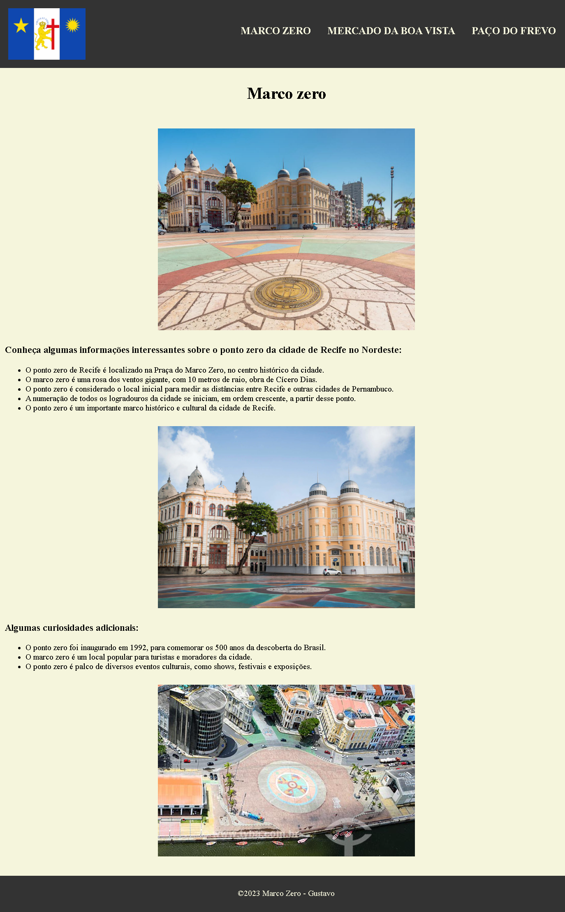

## Instruções do projeto

Agora que já aprendeu as propriedades básicas da CSS, é possível aprimorar a atividade anterior aplicando estilos para a página que você já criou.

## Meu screenshot do exercício proposto

Desta vez foi separado o css do html, feito alterações no cabeçalho e outras alterações.

